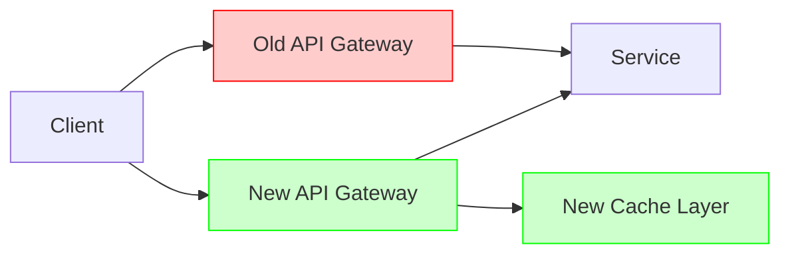

# GitHub Issue Creation Skill

## Workflow

### 1. Gather Context from Linked Issues/PRs

If the user provides GitHub issue or PR links:
- Use `mcp__github__issue_read` with `method: "get"` to fetch issue details
- Use `mcp__github__pull_request_read` with `method: "get"` to fetch PR details
- Review the linked content and incorporate relevant context into the new issue

### 2. Discover Issue Templates

**Step 1: Find issue templates**
Do steps 1a and 1b in parallel:

**Step 1a: Check target repository**
Use `mcp__github__get_file_contents` to check for templates:
```
owner: {repo_owner}
repo: {repo_name}
path: .github/ISSUE_TEMPLATE/
```

**Step 1b: Check org's .github repository**
```
owner: {repo_owner}
repo: .github
path: .github/ISSUE_TEMPLATE/
```

**Step 2: Make list of issue templates to choose from**
Make a list of issue templates to choose from:
- Use the results from Step 1a if available.
- Otherwise use the results from Step 1b.

**Step 3: Select appropriate template from the list**
Analyze the user's request and auto-select the most appropriate template:
- Bug reports: templates containing "bug" in name
- Feature requests: templates containing "feature" or "request" or "proposal" or "rfc"

If multiple templates exist and the best match is unclear, briefly list options and ask the user.

### 3. Create Proposal Diagrams

For issues that propose changes to architecture, workflows, or systems, create a unified Mermaid diagram showing both current and proposed states.

**Diagram Guidelines:**
- Draw a single unified diagram containing both current and new states
- Elements that will be **removed**: style with red (`fill:#ffcccc,stroke:#ff0000`)
- Elements that are **new/added**: style with green (`fill:#ccffcc,stroke:#00ff00`)
- Elements that **remain unchanged**: use default styling

**Example:**


**Legend:** Always include a legend below the diagram:
- Red = Current state (to be removed)
- Green = Proposed state (to be added)
- Default = Unchanged

### 4. Draft and Review (REQUIRED)

**IMPORTANT: Always write the draft to a file and present it to the user for review before creating the issue.**

**Step 1: Write the draft to NOTES_ISSUE.md**

Write the complete draft issue to `NOTES_ISSUE.md` in the current working directory:

```markdown
# Draft Issue

**Repository:** {owner}/{repo}
**Title:** {title}
**Labels:** {labels}

---

{full issue body}
```

**Step 2: Present for review**

After writing the file, inform the user:
```
I've written the draft issue to NOTES_ISSUE.md for your review.

Would you like me to create this issue, or would you like to make any changes?
```

Wait for explicit user confirmation before proceeding. If the user requests modifications, update `NOTES_ISSUE.md` with the changes before creating the issue.

### 5. Create the Issue

Only after user confirmation, use `mcp__github__issue_write` with:
```
method: "create"
owner: {repo_owner}
repo: {repo_name}
title: {issue_title}
body: {issue_body}
labels: {from_template_if_available}
```

**Fallback Body Structure (when no template available):**
If using a template, follow its structure. Otherwise use this format with no headings:

```markdown
[Brief description of the issue/proposal]

[Any relevant context from linked issues/PRs]

[Description of proposed changes, if applicable]

[Mermaid diagram if this is a proposal]

**Legend:**
- Red = Current state (to be removed)
- Green = Proposed state (to be added)

[Any other relevant information]
```
