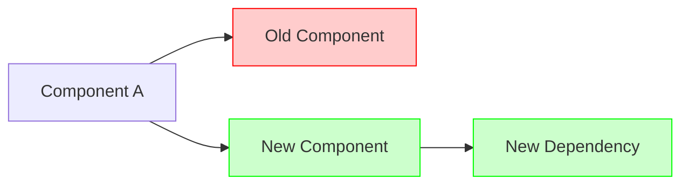

# GitHub PR Enhancement Skill

Analyzes an existing pull request on the current branch, compares its description against the actual implementation, and enhances it with accurate details, examples, and diagrams.

## Workflow

### 1. Get PR Info

Determine which PR to enhance based on user input:

**Scenario A: Current branch PR (default)**
```bash
gh pr view --json number,url,title,body,baseRefName,headRefName
```
If no PR exists for the current branch, inform the user and stop.

**Scenario B: PR number for current repo**
User provides just a number (e.g., `123`):
```bash
gh pr view 123 --json number,url,title,body,baseRefName,headRefName
```

**Scenario C: Explicit repo + PR**
User provides one of:
- `owner/repo#123` or `owner/repo 123`
- `https://github.com/owner/repo/pull/123`

Parse owner, repo, and PR number, then:
```bash
gh pr view 123 --repo owner/repo --json number,url,title,body,baseRefName,headRefName
```

### 2. Gather PR Context

**Step 1: Get the current diff**

*Option A: Local git (preferred when working in the PR's repo)*
If the current directory is a clone of the PR's repository:
```bash
git diff {baseRefName}...HEAD
```

*Option B: GitHub API (for remote repos)*
If working outside the repo or the repo isn't cloned locally, use `mcp__github__pull_request_read`:
```
method: "get_diff"
owner: {repo_owner}
repo: {repo_name}
pullNumber: {pr_number}
```

**Step 2: Get linked issues/PRs**
Scan the PR body for references like:
- `#123`, `fixes #123`, `closes #123`
- Full URLs to issues or PRs

For each reference, use `mcp__github__issue_read` or `mcp__github__pull_request_read` to fetch details.

**Step 3: Get linked documents**
If the PR body contains URLs to documentation or specs, use `WebFetch` to retrieve relevant context.

### 3. Identify Gaps & Staleness

Compare the current PR description against the actual diff:

| Check | Issue |
|-------|-------|
| Files mentioned but not in diff | Scope reduced - remove references |
| Files in diff but not mentioned | New additions - add descriptions |
| API endpoints changed | Missing request/response examples |
| Architecture changed | Missing diagram |
| Linked issue context | Details not incorporated |
| Test files changed | Missing test plan |

### 4. Enhance with Rich Content

**API Examples:**
For PRs touching HTTP endpoints, REST APIs, or RPC methods:
```
**Request:**
POST /api/resource
Content-Type: application/json

{
  "field": "value"
}

**Response:**
HTTP 201 Created

{
  "id": "abc123",
  "field": "value"
}
```

**Code Examples:**
For library/SDK changes, show usage:
```rust
// Before
let result = old_function(arg);

// After
let result = new_function(arg, options)?;
```

**Mermaid Diagrams:**
For architectural changes, create a unified diagram:


**Legend:**
- Red = Removed
- Green = Added

### 5. Draft and Review (REQUIRED)

**IMPORTANT: Always present the proposed changes for review before updating.**

Present in this format:
```
## PR Enhancement Draft

**Repository:** {owner}/{repo}
**PR:** #{number} - {title}

### Current Description
---
{current body}
---

### Proposed Description
---
{enhanced body with changes}
---

### Summary of Changes
- [List what was added/changed/removed]

Would you like me to update the PR with this enhanced description, or would you like to make any changes?
```

Wait for explicit user confirmation before proceeding.

### 6. Update the PR

Only after user confirmation, use `mcp__github__update_pull_request` with:
```
owner: {repo_owner}
repo: {repo_name}
pullNumber: {pr_number}
body: {enhanced_body}
```

Optionally update the title if it's also stale.

Report the updated PR URL when complete.
