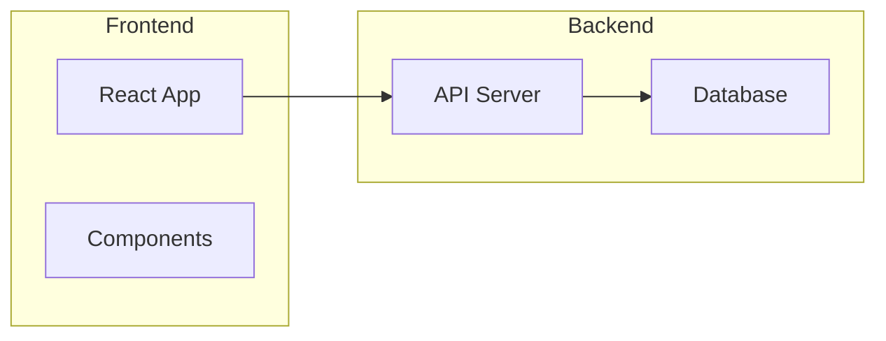
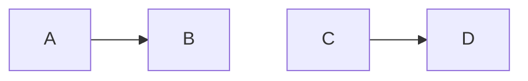
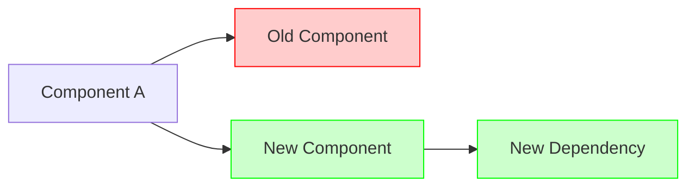

# Mermaid CLI Skill

Create, edit, and validate Mermaid diagrams using the `mmdc` command-line tool. This skill ensures diagrams are syntactically correct and visually well-organized before finalizing.

## Core Principles

1. **Always validate syntax** - Run `mmdc` to check syntax before considering a diagram complete
2. **Always inspect visually** - Read the generated SVG to evaluate node arrangement
3. **Always get user approval** - Open the SVG for user review before finalizing
4. **Prioritize clarity** - Diagrams are for humans; organized layouts matter

## Workflow: Creating New Diagrams

### Step 1: Set Up Working Directory

Generate a unique session ID and create the working directory:

```bash
mkdir -p /tmp/claude/[uid]
```

Replace `[uid]` with a short unique identifier (e.g., timestamp or random string like `mmd-20241219-abc123`).

### Step 2: Write Initial Diagram

Write the mermaid code to a temporary file:

```
/tmp/claude/[uid]/diagram.mmd
```
`

### Step 3: Validate and Generate SVG

Run the Mermaid CLI to validate syntax and generate output:

```bash
mmdc -i /tmp/claude/[uid]/diagram.mmd -o /tmp/claude/[uid]/diagram.svg -w 4096
```

If syntax errors occur, analyze the error message, fix the mermaid code, and retry.

### Step 4: Inspect the SVG

Use the Read tool to examine the generated SVG file:

```
Read /tmp/claude/[uid]/diagram.svg
```

Evaluate the diagram for:
- Node positioning and flow direction
- Edge crossings (minimize these)
- Grouping of related elements
- Overall readability and organization

### Step 5: Iterate on Layout

If the layout is chaotic or unclear, refactor the diagram:
- Reorder node declarations (affects layout order)
- Change direction (TB, LR, RL, BT)
- Add subgraphs to group related nodes
- Simplify complex connections

Repeat Steps 2-4 until the diagram is well-organized.

### Step 6: User Review

Request permission to open the SVG for user inspection:

```bash
open /tmp/claude/[uid]/diagram.svg
```

Wait for user confirmation or feedback. If changes are requested, iterate on the diagram.

### Step 7: Finalize

Once approved, copy the final mermaid code to the target location (markdown file or standalone .mmd file).

## Workflow: Editing Existing Diagrams

### Step 1: Read Source File

Read the file containing the mermaid diagram. For markdown files, extract the content within the mermaid code fence:

````
```mermaid
... diagram code ...
```
````

### Step 2: Set Up Working Directory

Generate a unique session ID and create the working directory:

```bash
mkdir -p /tmp/claude/[uid]
```

### Step 3: Write to Working File

Write the extracted mermaid code to `/tmp/claude/[uid]/diagram.mmd`.

### Step 4: Validate, Inspect, and Iterate

Follow Steps 3-6 from "Creating New Diagrams" to validate, generate SVG, inspect, and refine the layout.

### Step 5: Update Original

Once approved, update the original source file with the improved diagram code.

## Layout Best Practices

### Direction Selection

| Direction | Use When |
|-----------|----------|
| TB (top-bottom) | Hierarchies, org charts, decision trees |
| LR (left-right) | Processes, timelines, data flows |
| BT (bottom-top) | Dependency graphs, build systems |

### Subgraphs

Group related nodes to improve organization:



### Node Ordering

Declare nodes in the order they should appear. The declaration order influences layout positioning.

### Edge Management

- Minimize edge crossings by reordering nodes
- Use subgraphs to contain related connections
- Consider changing direction if edges are tangling

### Invisible Links for Spacing

Add invisible links to control spacing (use sparingly):



## Supported Diagram Types

| Type | Declaration | Use Case |
|------|-------------|----------|
| Flowchart | `flowchart TB` | Processes, workflows, decisions |
| Sequence | `sequenceDiagram` | API calls, interactions, messaging |
| State | `stateDiagram-v2` | State machines, lifecycles |
| Class | `classDiagram` | OOP structures, relationships |
| ER | `erDiagram` | Database schemas |
| Git | `gitGraph` | Branch histories |
| Pie | `pie` | Data distributions |
| Mindmap | `mindmap` | Brainstorming, hierarchies |

## mmdc Command Reference

Basic usage:
```bash
mmdc -i input.mmd -o output.svg -w 4096
```

Common options:
| Option | Description |
|--------|-------------|
| `-i <file>` | Input mermaid file |
| `-o <file>` | Output file (svg, png, pdf) |
| `-b <color>` | Background color (e.g., white, transparent) |
| `-t <theme>` | Theme: default, forest, dark, neutral |
| `-w <width>` | Page width in pixels |
| `-H <height>` | Page height in pixels |

## Proposal Diagrams

For diagrams showing before/after states (common in PRs and issues), use color styling:



Legend:
- Red (`fill:#ffcccc,stroke:#ff0000`) = Removed
- Green (`fill:#ccffcc,stroke:#00ff00`) = Added
